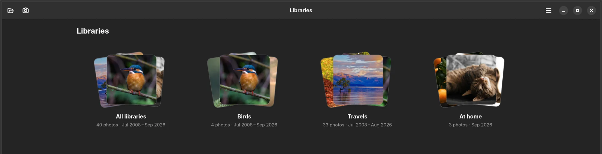
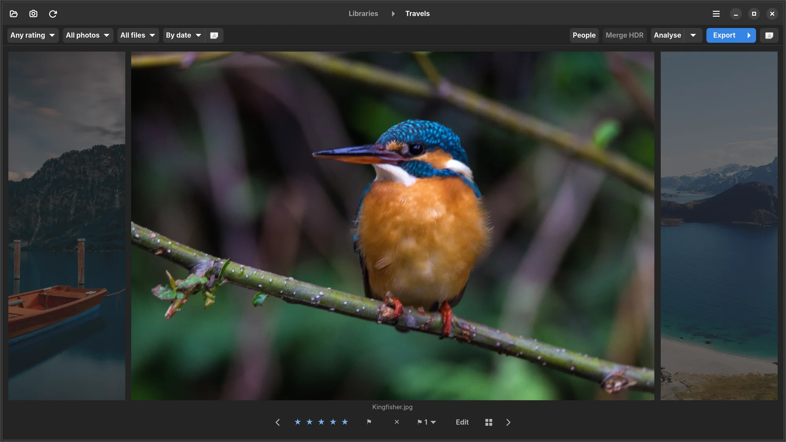
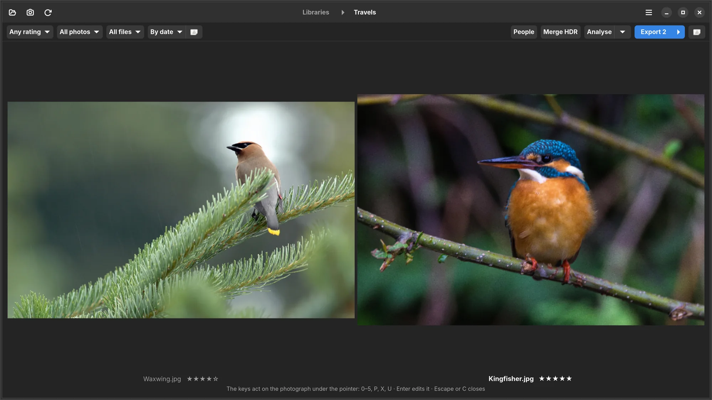
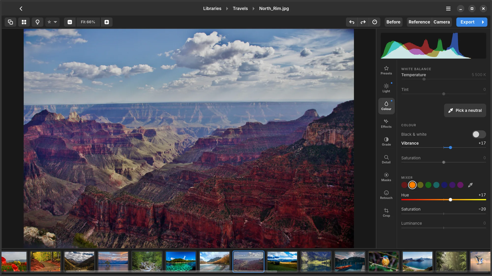
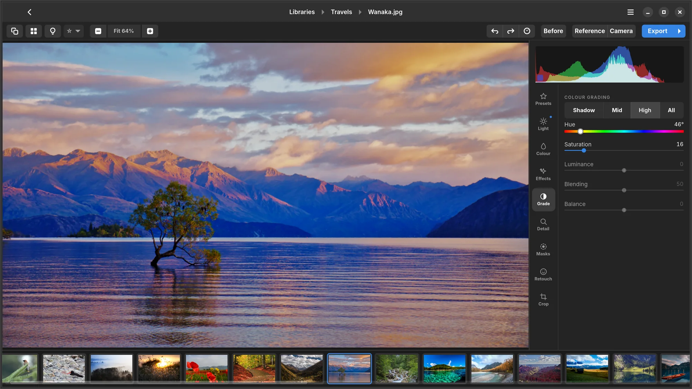
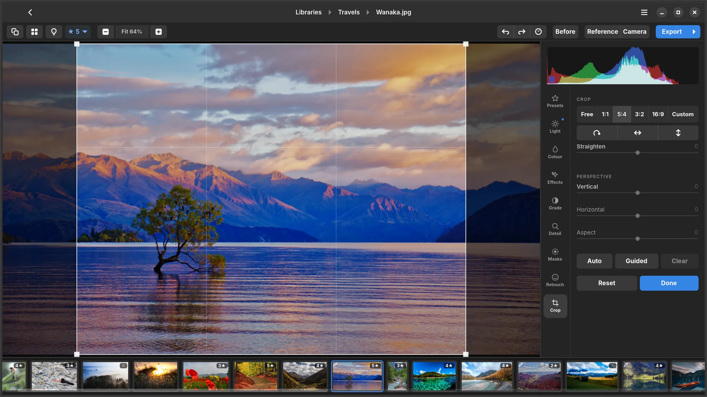
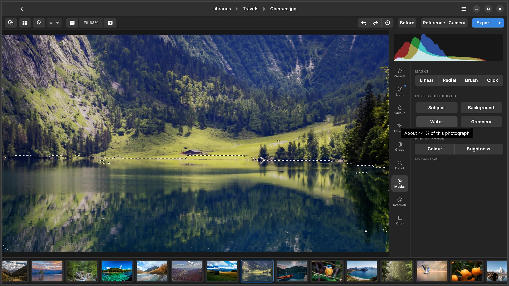
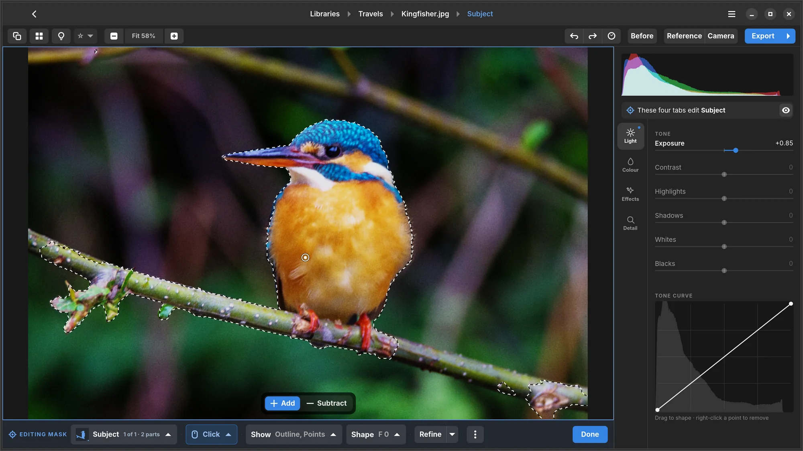
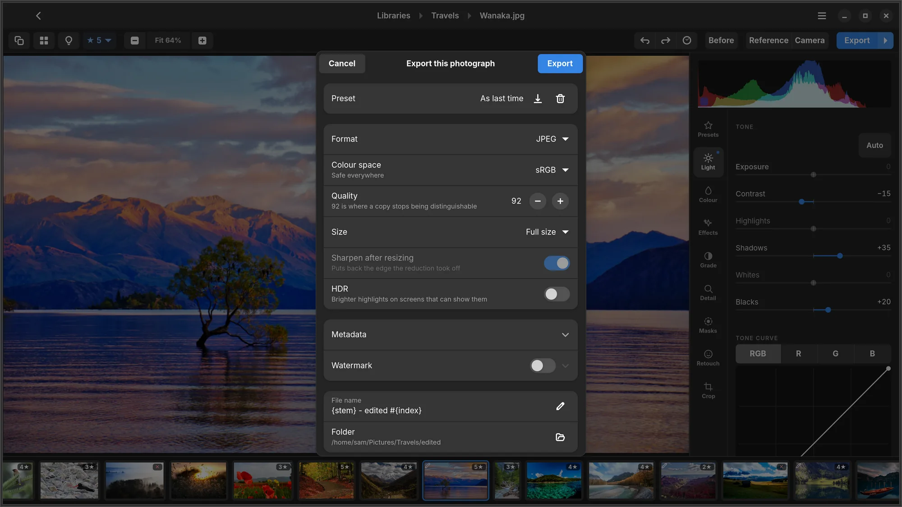

<p align="center">
  <picture>
    <source media="(prefers-color-scheme: dark)" srcset="data/branding/icon-dark.png">
    
  </picture>
</p>

<h1 align="center">Numa</h1>

<p align="center">
  <b>A RAW photo editor and library for Linux.</b><br>
  Add a folder, cull the shoot, develop the frames you keep, export them.<br>
  Your originals are never moved, copied or written to.
</p>

<p align="center">
  <a href="https://github.com/simmmmm/Numa/releases"><b>Download</b></a> ·
  <a href="#features">Features</a> ·
  <a href="#installing">Installing</a> ·
  <a href="#building-from-source">Building</a> ·
  <a href="docs/ENGINEERING.md">How it works</a> ·
  <a href="docs/FEATURES.md">Feature index</a>
</p>

<p align="center">
  
  
  
  
  
</p>


Numa is a native GTK 4 and libadwaita application written in Rust. It was built
around a Fujifilm workflow, but it opens and develops every RAW format its
decoder reads: twenty-nine formats, 811 camera and mode combinations, plus
JPEG, PNG and HEIF. Everything runs on your own computer, including the
machine-learning models behind masks, faces and the AI tools.

The code was written with Claude (Anthropic); see [How it was made](#how-it-was-made).

---

## New in 0.20

- **Cull mode.** The loupe is now built for going through a shoot: `Up` picks,
  `Down` rejects, both move on to the next frame, and `Backspace` takes the
  last mark back. Bursts are shown as a row of marks under the name, so you
  can see which frame of the burst you are on and which one Numa thinks is
  best.
- **Reasons, not just scores.** Frames are flagged as *soft*, *soft · slow
  shutter*, *blown*, *nearly black* or *nearly blank*, and a face with its
  eyes shut asks *eyes closed?*. Clipping is measured on the raw data, not on
  the camera's JPEG.
- **Where the camera focused.** For Fujifilm files the loupe draws the AF
  point; a double-click inside it goes to 1:1 on that spot.
- **Cull to a number.** Set a target and the loupe counts picks against it:
  *⚑ 73 / 50*.
- **A faster editor.** Rendering runs off the main thread and the newest
  change always wins, so sliders stay smooth while you drag, also when zoomed
  in and on a straightened photograph.
- **A quieter library.** Rescans only read files that changed, thumbnails are
  made at the size they are shown, and the thumbnail cache stays under 2 GB.

The full history is in the [release notes](data/com.tijmen.Numa.metainfo.xml).

---

## Features

<table>
<tr>
<td width="33%" valign="top">

<b>Library</b><br>
Folders instead of imports. Justified rows, ratings, flags, albums, people,
several libraries, import from a card.

</td>
<td width="33%" valign="top">

<b>Culling</b><br>
A loupe for picking and rejecting from the keyboard, bursts, suggested
ratings with a reason, and side-by-side compare.

</td>
<td width="33%" valign="top">

<b>Developing</b><br>
Light, tone curve, white balance, HSL mixer, colour grading, black and white,
DNG camera profiles, wide-gamut output.

</td>
</tr>
<tr>
<td valign="top">

<b>Masks</b><br>
Gradients, brush and lasso, plus masks the photograph finds itself: sky,
water, subject, the animal, anything you click on.

</td>
<td valign="top">

<b>Detail and repair</b><br>
Sharpening, noise reduction, AI denoise, AI sharpen, Super Resolution, heal,
clone, Remove, dust, lens corrections.

</td>
<td valign="top">

<b>Export</b><br>
JPEG, PNG, 16-bit TIFF, AVIF, JPEG XL, DNG and HDR JPEG, with presets,
watermarks, metadata control and batches.

</td>
</tr>
</table>

---

## Library

**Folders, not imports.** A library is a folder on disk. Numa scans it and
leaves the files where they are. Each library keeps its catalog in a hidden
`.numa` folder inside it: ratings, flags, edits, analysis and the names on
faces. Move the folder to another drive or computer, add it there, and
everything comes with it. A weekly backup of that catalog is kept in the same
place. A library on a drive that is not connected shows as offline rather than
empty.

**Rows at each photograph's own shape.** Thumbnails are laid out in justified
rows that fill the width, so portrait and landscape frames sit side by side
without cropping. A popover sets the row size and the spacing. Thumbnails are
made at the resolution the row needs on HiDPI screens, only what is near the
screen is decoded, and the cache is kept to a budget, so a library of
thousands scrolls without holding all of them in memory.

**Rate, flag and filter from the keyboard.** `0`–`5` rate, `P` picks, `X`
rejects and `U` clears, in the library, the loupe and the editor alike. Filter
by rating, flag, file type and the culling measures, and sort by date, name,
rating, sharpness or suggested rating. A filter that narrows the grid shows in
the accent colour, and it is remembered between sessions.

**See what you have worked on.** Photographs with adjustments carry a small
pencil mark in the library and in the filmstrip. Opening a photograph does not
count as editing it.

**RAW and JPEG pairs.** A camera set to write both leaves two files per frame.
Both stay in the library as their own cards, and the file-type filter narrows
the grid to the RAWs or to everything else.

**Several libraries, and albums across them.** Add, rename and remove
libraries and switch between them from the header bar, or from the
**Libraries** page, where each one is a stack of its best photographs. Albums
are independent of folders and can hold photographs from any library.



**Import from a card or a camera.** Put in a card or plug in a camera and Numa
offers to import it. Photographs a library already has are skipped, the rest
are split into shoots by date, and each shoot is offered the library it
belongs to, or a new folder beside the others, with a name pattern you choose.

**Open with Numa.** Numa can be the default application for RAW files, HEIF,
JPEG, PNG, TIFF, WebP and BMP. A photograph opened from the file manager lands
in the loupe, with the folder it came from in the grid behind it.

Deleting a photograph moves the file to the desktop's trash, and the dialog
says first that its rating and edits go with it.

## Culling



**The loupe.** `Space` shows the selected photograph large, with its
neighbours on either side. `Left` and `Right` step through the shoot, `Up`
picks and `Down` rejects and both go on to the next frame, and `Backspace`
takes the last mark back and returns to that frame. `Enter` opens the editor.
Delete does nothing while the loupe is open, so a cull is never one slip away
from losing a file; a reject never removes anything.

**Analyse** runs over a whole library in the background, with a progress
count and a Stop button, and measures each frame:

- **Sharpness**, as Laplacian energy on a standardised version of the frame,
  so a contrasty photograph does not score as sharper than a soft one. A soft
  frame shot more than five stops slower than 1/focal length says *soft · slow
  shutter*.
- **Blown highlights**, counted on the raw's own values where there is a raw,
  because the camera's JPEG goes white well before the sensor does.
- **Empty frames**: a lens cap, a flash into the dark, a frame gone white, as
  *nearly black*, *nearly white* or *nearly blank*.
- **Faces**, found with YuNet, and how sharp each face is. A crisp background
  behind a soft face is a reject even when the frame as a whole measures sharp.
  Closed eyes are asked about (*eyes closed?*), never decided.
- **Bursts**, grouped by a perceptual hash and by time, with the sharpest frame
  of each burst marked as the best of it. The same scene shot again minutes or
  days later is recognised as well.

From these Numa suggests a rating from 0 to 5, shown beside each photograph
with a short note (such as *best of burst*, *soft* or *soft face*) and
available as a sort. The suggestion comes from explicit rules rather than a
trained aesthetic model, and it never overwrites a rating you gave. Every mark
given in the loupe is kept in the library's catalog with its time.

**Compare** two to four selected photographs side by side with `C`, zoomed and
panned together, and rate or reject them from there. The keys act on the
photograph under the pointer.



## People

Numa recognises faces across all of your libraries with SFace, aligned on
YuNet's landmarks.

- **Name a face once.** Every other photograph with a similar face offers that
  name as a guess. Enter confirms it, typing corrects it. Only the names you
  confirm are stored; the likeness does the rest, so a name given today also
  finds last year's photographs.
- **Name faces in bulk.** The People dialog groups faces that are probably the
  same person ("In 38 photographs — who is this?") so a whole group gets a name
  at once. Strangers who keep turning up can be set aside, renaming a person
  renames them everywhere, and giving two people the same name merges them.
- **Browse by person.** Everyone with a name is listed in the library picker
  under the libraries. Picking a person shows every photograph they appear in,
  across all libraries, and the rating, flag and sort filters still apply.

## Developing


Everything is non-destructive. Edits are stored as a list of operations and
parameters, and the original file is only ever read. Preview and export run
the same code on the same edit stack; the preview just uses fewer pixels.

**Light.** Exposure, contrast, highlights, shadows, whites and blacks. **Auto**
sets exposure and the black and white points and leaves the matters of taste
alone. It is a button, never a default.

**Tone curve.** A point curve over the photograph's own histogram, on the
composite channel and on red, green and blue separately. The curve is a
monotonic cubic, so a steep section never folds back on itself, and it is
applied with interpolation so it does not introduce banding in skies and
shadows.

**White balance.** Temperature in Kelvin and tint, applied in the camera's own
colour space before the colour matrix, which is where it is physically correct.
Or pick a neutral in the photograph.

**Colour.** Vibrance and saturation. An eight-colour HSL mixer with a pipette:
click the sky in the photograph and the mixer selects whichever colour the sky
actually is. **Black & white** is a switch, as in Lightroom, and turns the
mixer into the black-and-white mix: how light each colour's grey comes out.

<table>
<tr>
<td width="50%"></td>
<td width="50%"></td>
</tr>
<tr>
<td><sub>White balance, vibrance and the HSL mixer.</sub></td>
<td><sub>Colour grading per tonal range, with blending and balance.</sub></td>
</tr>
</table>

**Colour grading** with separate tints for shadows, midtones, highlights and
the whole frame, plus blending and balance. A grade also tones a black and
white conversion.

**Effects.** Clarity, texture and dehaze; a vignette with amount, midpoint,
roundness and feather; and grain with amount, size and roughness.

**Local tone mapping.** HDR compression, clarity and texture use the same
edge-aware guided filter at different scales: clarity works at the size of a
cheek or a cloud, texture at the weave of a fabric or the bark of a tree.
Negative texture softens skin without softening eyes. Negative clarity spreads
light like a diffusion filter rather than blurring.

**Camera profiles.** Numa reads DNG camera profiles (`.dcp`): forward
matrices, hue/saturation maps and look tables. The one made for your camera is
used automatically, matched on the camera model written inside the profile
rather than on its filename.

**The base render.** A RAW is developed with a tone curve fitted against the
camera's own JPEGs, and exposure is matched per image to the camera's
rendering, so the untouched starting point already looks like a finished
photograph rather than a flat scan. Where all three channels hit the sensor's
ceiling, white balance leaves them white instead of tinting them magenta.

**Colour spaces.** Export in sRGB, Display P3, Adobe RGB or ProPhoto RGB,
with the matching ICC profile embedded. A wide-gamut export is rendered in its
own space, so colours the sensor saw beyond sRGB reach the file. On screen,
photographs are converted to your display's own colour profile, so a
wide-gamut screen does not oversaturate them.


**Presets.** Save an edit, or part of one, as a preset, and apply it to the
open photograph or a whole selection. The Presets tab shows each preset as a
thumbnail of the photograph you are working on, and resting on one previews it
on the canvas. Lightroom Classic `.lrtemplate`, Lightroom `.xmp` and Capture
One `.costyle` and `.costylepack` presets can be imported; tone, presence,
the HSL mixer, colour grading, curves, white balance, detail, vignette and
grain are translated.

## Detail


**Sharpening** is an unsharp mask on log luminance, applied as a gain so edges
do not grow colour fringes. It has amount, radius and masking, where masking
keeps sharpening off flat areas and noise. It is on by default at a moderate
25, because every demosaic softens a little.

**Noise reduction** has separate luminance and colour controls. Luminance noise
is smoothed with an edge-preserving guided filter, and **Detail** decides
where grain ends and structure begins. Colour noise reduction takes hue from a
heavily smoothed copy and brightness from the original. It is on by default,
because colour speckle is never wanted. On X-Trans files the colour the
demosaic invents is taken out before any of this.

**AI denoise** runs SCUNet over the whole photograph once, in the background,
and keeps the answer, so a slider never waits on it. With the optional GPU
download it runs in half precision on the graphics card: about two minutes for
a 40 MP frame, five on the processor.

**AI sharpen** undoes the blur of a hand that moved, with Restormer, run
once like AI denoise and on the denoised frame when both are on.

**Super Resolution** exports a photograph at twice its size each way with
RealPLKSR, the faithful upscaler darktable uses: detail rather than blur, and
no invented texture.

**Moiré** removes false colour from fine repeating patterns such as fabric and
roof tiles. **Defringe** removes the purple and green rims that fast lenses
leave on high-contrast edges.

## Lens and geometry

**Lens corrections.** Vignetting, distortion and lateral chromatic aberration
are corrected in a single resampling pass. Fujifilm cameras write their lens
corrections into each RAF, and Numa uses those first. Everything else is
corrected from the lensfun database.

**Crop and straighten** with handles, aspect ratio presets and a rule-of-thirds
overlay. Quarter turns, mirroring and EXIF orientation are handled.

**Perspective.** Vertical, horizontal and aspect corrections, or **Auto**,
which finds the photograph's own lines and puts converging verticals back
upright. **Guided** lets you draw the lines that should be straight.



## Masks

Every mask carries the full set of Light, Colour, Effects and Detail
adjustments, so a local edit is the same edit as a global one, applied through
a shape. Masks are kept in a list that can be reordered by dragging, and each
can be inverted, feathered, and have its edge moved in or out. A mask survives
a crop, a straighten or a quarter turn with the clicks and strokes that shaped
it.

**Draw them:** linear and radial gradients, a brush and a lasso. The brush and
lasso add to or subtract from any mask, so a sky mask that caught the roofline
can be cleaned up by painting it out.

**Let the photograph find them:**

- **Found in this photograph.** Subject, Background, Sky, Water, Greenery,
  Buildings, Ground and more, from EfficientViT-Seg trained on ADE20K. Only the
  masks for things actually in the frame are offered, and resting on one
  outlines it and says how much of the photograph it covers.
- **Click to select.** Click any object and SlimSAM cuts it out, including
  things no segmentation model has a word for, such as a kite.
- **Subject.** Person and Animal fall back to a matting model when the
  semantic model finds nothing, and the chip names the animal ("Bird", "Dog")
  when an image classifier is confident.
- **Refine.** *Edge* traces a real edge with IS-Net; *Hair* follows hair and
  fur with ViTMatte.
- **By colour or brightness.** Colour range and luminance range masks select
  every pixel of a colour or between two brightnesses, anywhere in the frame.

A mask can be shown as a coloured wash, an outline, or both.

<table>
<tr>
<td width="50%"></td>
<td width="50%"></td>
</tr>
<tr>
<td><sub>Masks found in the photograph. Resting on <i>Water</i> outlines it.</sub></td>
<td><sub>A subject mask with its own exposure, refined from the mask bar.</sub></td>
</tr>
</table>

## Retouching

**Heal** replaces a spot with texture from elsewhere while keeping the
surrounding tone, solved as a Poisson blend. **Clone** copies it as is. The
source and destination are both drawn on the photograph, so it is always clear
which is which. **Remove** takes out what is under a circle and fills it from
around it with LaMa, which continues a wall, a fence or a horizon through the
hole. **Remove people** finds the passers-by behind the subject and removes
them the same way. **Find dust** heals the specks a dirty sensor leaves in
skies and walls, and **Pet eye** puts out the glow of a flash in an animal's
eye.

**Face retouching** appears only when a face has been found: automatic spot
removal, skin smoothing, evenness, red-eye and teeth whitening.

## Export



- **JPEG, PNG, 16-bit TIFF, AVIF, JPEG XL or DNG**, with the quality you
  choose and the ICC profile of the colour space you export in. JPEG XL uses
  the libjxl on your computer. A DNG is the raw itself, with the edit as a
  preview and as Camera Raw settings Lightroom reads.
- **HDR**: a JPEG with a gain map, which HDR screens show with the
  highlights as bright as the scene had them and everything else shows as the
  ordinary photograph.
- **Presets** for export settings, a **watermark** in a corner of your choice,
  and a file name template.
- **Full size, or a long edge from 4096 down to 1080 pixels**, resized with
  Lanczos and never enlarged. Output sharpening restores the edge that
  downscaling takes off.
- **The camera's own EXIF**, carried over, with the GPS position removed if
  you ask. **IPTC** in XMP: creator, copyright, rating, and the people and
  albums a photograph is in as keywords.
- **Batch export** of a selection from the library, with the same settings as
  the editor. Masks are recomputed before export, so they apply the same way
  they did on screen.
- **Never overwriting.** Files go to an `edited` folder inside the library, or
  to a folder you choose.

## Working in the editor

- **Saving is automatic**, two seconds after the last change, and when you
  step to another photograph, leave the editor or quit.
- **Undo and redo** cover every adjustment, geometry and mask, with a
  history list that names each step. **Snapshots** keep named versions of an
  edit to go back to.
- **Before and after**: hold `Space` to see the as-shot rendering.
- **Reference**: keep one developed frame beside the one you are working on
  and match a set to it, or show the camera's own JPEG there instead.
- **A live RGB histogram**, with clipped shadows and highlights shown on the
  photograph.
- **Copy and paste settings** between photographs, with a checklist of what to
  paste: white balance, tone, colour, tone curve, detail and crop. Paste onto a
  single photograph or a whole selection.
- **A filmstrip** to move between frames without returning to the library.
- **Zoom** from fit to 1:1 and beyond. Above 1:1 pixels are drawn as pixels.
  When you zoom past what the preview resolution can show, the visible region
  is rendered from the full-resolution file.
- **Adjusted sliders are highlighted**, so you can see at a glance what was
  changed on a photograph. Double-click or right-click a slider to reset it,
  and hold Shift with the arrow keys to move it ten steps at a time.
- **Info** shows camera, lens, exposure, Fujifilm film mode and dimensions.
- **HDR merge** combines a bracket into one high-dynamic-range image. A
  bracket shot by hand is lined up first.
- **Keyboard shortcuts** are listed under `Ctrl+/`.

## Preferences

Three pages, with a search across all of them. **General** has the display
profile, opening photographs with Numa, and a daily check for new versions
that is off until you turn it on; nothing about you or your photographs is
sent. **Add-ons** lists the optional models with their size, licence and what
they are for, to download one by one or all at once. **Storage** shows Numa's
own folders and how much each takes, clears the thumbnail cache, and says what
to delete to remove Numa again.

---

## Cameras

Numa reads anything [`rawler`](https://github.com/dnglab/dnglab) reads:
twenty-nine RAW formats across 811 camera and mode combinations, plus JPEG,
PNG and HEIF (`.heic`, `.heif`, `.hif`). The list of supported formats is taken from the decoder, so it grows when
the decoder does.

Fujifilm files get extra support: the Markesteijn X-Trans demosaic at full
resolution, the film simulation the camera was set to, and the lens
corrections stored in the RAF. Everything else goes through the same pipeline
without them.

Tested end to end on Fujifilm RAF and Sony ARW files.

---

## Installing

Each release on the [Releases page](https://github.com/simmmmm/Numa/releases)
comes in two forms for 64-bit Intel and AMD machines: a Flatpak bundle and an
AppImage. Both keep their libraries, presets and models in the same folders
(see *Where things live*), so moving from one to the other loses nothing.

**Flatpak.** Needs Flatpak with Flathub added; the GNOME 50 runtime is fetched
the first time, about a gigabyte, and shared with other applications after
that. A newer bundle installs over the old one the same way.

```sh
flatpak install --user Numa-*-x86_64.flatpak
flatpak run com.tijmen.Numa
```

To have photographs open in Numa, choose it under *Open With* in the file
manager and switch on *Always use for this file type*.

**AppImage.** A single file, `Numa-<version>-x86_64.AppImage`, for glibc 2.39
or newer: Ubuntu 24.04 and later, Debian 13 and later, Fedora 40 and later, and
current rolling releases such as Arch.

A downloaded file is not executable, and until it is, double-clicking it does
nothing. In GNOME Files, open **Properties** on the file and turn on
**Executable as Program**; or in a terminal:

```sh
chmod +x Numa-*-x86_64.AppImage
./Numa-*-x86_64.AppImage
```

After that it starts with a double-click. Keep the file where it is, for
example in `~/Applications`; nothing is installed elsewhere.

The AppImage mounts itself with FUSE and needs the `fusermount3` (or
`fusermount`) program, which most desktop installations already have. It does
not need `libfuse2`. If it does not start and running it from a terminal
mentions fusermount or FUSE, install:

| Distribution | Package |
|---|---|
| Debian, Ubuntu | `sudo apt install fuse3` |
| Fedora | `sudo dnf install fuse3` |
| Arch | `sudo pacman -S fuse3` |

Where FUSE is not available at all, for example in a container, it can run
without it; it then unpacks itself to a temporary folder on every start, which
takes a few seconds longer:

```sh
./Numa-*-x86_64.AppImage --appimage-extract-and-run
```

**Opening photographs with Numa.** Once it is in the applications menu, Numa
is offered under *Open With* for RAW files, HEIF, JPEG, PNG, TIFF, WebP and
BMP. To make it the one that opens them, turn on **Open photographs with
Numa** in Preferences — or, from a terminal,
`packaging/set-default.sh ~/Applications/Numa-*.AppImage`. A photograph opened
that way lands in the loupe, with the folder it came from in the grid behind
it: the next frame is one arrow key away, and Enter opens the editor.

On first start Numa offers to add itself to the applications menu, and to
download the additional files described below: the machine-learning models and
RawTherapee's camera profiles. If the AppImage is moved or replaced by a newer
one, the menu entry follows it the next time Numa starts from the new place.
Preferences has a switch to remove the entry again.

## Building from source

You need a Rust toolchain, GTK 4.12 or newer, libadwaita 1.5 or newer, and
`pkg-config`.

```sh
git clone git@github.com:simmmmm/Numa.git
cd Numa
./dev/run.sh
```

Some features use additional files that are downloaded separately: the
machine-learning models for masks, click to select, subject edges, faces and
animal names, and RawTherapee's camera profiles. Numa offers them on first
start, and **Preferences** (`Ctrl+,`) downloads them, shows what is installed
and opens the folders they live in. Every file is checked against its SHA-256
before it is used. Without them everything else works. From a source checkout,
`./dev/fetch-models.sh` fetches the models as well.

### Where things live

| | |
|---|---|
| Library catalog, history, snapshots, backups | `<your library>/.numa/` |
| Grid thumbnails | `<your library>/.numa/thumbs/` |
| Application settings, list of libraries, albums | `~/.local/share/numa/catalog.db` |
| Models | `~/.local/share/numa/models/` |
| Presets | `~/.local/share/numa/presets/` |
| Camera profiles you add | `~/.local/share/numa/profiles/` |
| Downloaded RawTherapee profiles | `~/.local/share/numa/rawtherapee-dcpprofiles/` |
| Larger thumbnails, AI denoise results | `~/.cache/numa/` |
| Exports | `<your library>/edited/` unless another folder is chosen |

These are the usual locations, and the Flatpak uses them too, so it shares its
libraries, presets and models with an AppImage or a build of your own.
Preferences shows the actual folders. Deleting a thumbnail folder or the
cache only means those files are made again.

### Packages

There is a Flatpak manifest in `packaging/flatpak/` and an AppImage build in
`packaging/appimage/`, which builds inside a container so the result runs on
older distributions:

```sh
./packaging/appimage/build.sh
```

---

## How it renders

```
RAW file
  └─ decode + demosaic ──────────> linear RGB, f32, scene-referred
       │
       ├─ colour stage      white balance in camera space, then the camera
       │                    matrix and its profile's tables   (cached)
       │
       ├─ geometry          lens corrections, quarter turns, crop,
       │                    straighten, perspective
       │
       └─ pixel stack
            heal and clone ──> face retouching
            noise reduction ──> sharpening
            exposure, contrast, the four tone regions, vibrance, saturation
            the colour mixer
            local tone mapping (HDR, clarity, texture)
            masks, each the same stack again, faded in
            colour grading
            the base tone curve ──> your tone curves ──> output space ──> 8-bit
```

Values stay scene-linear until the last step. In linear light exposure is a
multiplication, downscaling averages correctly, and highlights above 1.0 are
still there for highlight recovery to work with.

While you edit, Numa renders only the region on screen, at the resolution the
screen can show. During a slider drag it draws a fast draft and sharpens the
picture as soon as you let go.

[`docs/ENGINEERING.md`](docs/ENGINEERING.md) explains the decisions and the
measurements behind them: white balance in camera space, the tone curve fitted
against camera JPEGs, DNG profiles, the demosaic, lens corrections, face
recognition thresholds, and the bugs that were hardest to find.

---

## Built on

| Crate | Used for |
|---|---|
| [`gtk4`](https://crates.io/crates/gtk4) + [`libadwaita`](https://crates.io/crates/libadwaita) | The interface. |
| [`rawler`](https://crates.io/crates/rawler) | RAW decoding, demosaic and colour matrices, in pure Rust with X-Trans support. |
| [`heic-rs`](https://crates.io/crates/heic-rs) | HEIF and HEIC, in pure Rust. |
| [`zip`](https://crates.io/crates/zip) | Opening Capture One style packs. |
| [`rusqlite`](https://crates.io/crates/rusqlite) | The catalogs. A rating writes one row, and a filter is a `WHERE` clause. |
| [`ort`](https://crates.io/crates/ort) + [`ndarray`](https://crates.io/crates/ndarray) | ONNX Runtime for every model. |
| [`image`](https://crates.io/crates/image) + [`rayon`](https://crates.io/crates/rayon) | Pixel work across all cores. |
| [`lensfun`](https://crates.io/crates/lensfun) | Lens corrections for lenses that do not describe themselves in the file. |
| [`serde`](https://crates.io/crates/serde) · [`serde_json`](https://crates.io/crates/serde_json) · [`dirs`](https://crates.io/crates/dirs) · [`log`](https://crates.io/crates/log) · [`env_logger`](https://crates.io/crates/env_logger) · [`byteorder`](https://crates.io/crates/byteorder) · [`libc`](https://crates.io/crates/libc) | Supporting work. |

| Model | Used for |
|---|---|
| EfficientViT-Seg-B2 (ADE20K) | Semantic mask presets |
| SlimSAM-77 | Click to select |
| IS-Net | Matting and refined edges |
| ViTMatte-S | Hair and fur in Refine edge |
| YuNet | Face detection |
| open-closed-eye-0001 (OpenVINO) | Asking about closed eyes in culling |
| SFace | Face recognition |
| PP-ResNet50 (ImageNet) | Naming the animal in a subject mask |
| SCUNet | AI denoise |
| Restormer | AI sharpen |
| RealPLKSR | Super Resolution |
| LaMa | Remove |
| YOLOX-s | Finding people to remove |

---

## Roadmap

[`docs/FEATURES.md`](docs/FEATURES.md) tracks every feature by ID and is the
only place status is kept: currently **183 built**, 8 partly built, 5 planned
and 11 withdrawn, each withdrawal with its reason.

**Still open.** A neutral Fujifilm X-T5 camera profile, which needs Provia
reference frames · settling whether a developed frame is as sharp as
Lightroom's · crash reports and feedback, sent only when you say so · a GPU
pipeline, if the processor one ever stops being enough.

The full list, generated from the status markers, is at the end of
[`docs/FEATURES.md`](docs/FEATURES.md). How each number in it was reached is in
[`docs/ENGINEERING.md`](docs/ENGINEERING.md) — corrections welcome.

---

## How it was made

Numa is written by Claude, an AI model by Anthropic, working from the
photographer's feedback: comparisons with other raw developers and the
camera's own JPEGs, and reports of what looked wrong. Decisions and
measurements are recorded in [`docs/ENGINEERING.md`](docs/ENGINEERING.md), and
there are more than 600 automated tests, run on every push together with one camera
file per make.

---

## Licence

[PolyForm Noncommercial 1.0.0](LICENSE). You may read, run, modify and share
Numa for any non-commercial purpose. Commercial use requires a separate
licence from the author.

The additional files each keep their own licence: the models are Apache-2.0 or
MIT, and RawTherapee's camera profiles are GPL-3.0. The licence texts are
published with the downloads.

## Acknowledgements

- **[RawTherapee](https://rawtherapee.com)** for the DNG camera profiles, most
  of them made by Maciej Dworak. Each names its author in its
  `ProfileCopyright` tag. They are redistributed unmodified under GPL-3.0.
- **[rawler](https://github.com/dnglab/dnglab)** for RAW decoding in Rust.
- **[MIT Han Lab](https://github.com/mit-han-lab/efficientvit)** for
  EfficientViT, **[Xenova](https://huggingface.co/Xenova)** for the ONNX
  conversion of SlimSAM, **[rembg](https://github.com/danielgatis/rembg)** for
  the IS-Net export, and **[OpenCV Zoo](https://github.com/opencv/opencv_zoo)**
  for YuNet, SFace and PP-ResNet, **[SCUNet](https://github.com/cszn/SCUNet)**
  for the denoiser, **[darktable](https://www.darktable.org)** for choosing
  and converting RealPLKSR, **[LaMa](https://github.com/advimman/lama)** and
  [Carve](https://huggingface.co/Carve/LaMa-ONNX)'s export of it, and
  **[YOLOX](https://github.com/Megvii-BaseDetection/YOLOX)** from Megvii, and
  **[Restormer](https://github.com/swz30/Restormer)** for AI sharpen, and
  **[OpenVINO Open Model Zoo](https://github.com/openvinotoolkit/open_model_zoo)**
  for the open-closed eye model.

### Photographs in the screenshots

The tone curve and detail screenshots show the author's own RAW files. The
others show JPEGs from the Ubuntu and Ubuntu Budgie wallpaper collections,
used under their licences (CC BY-SA, CC BY and CC0), renamed for a demo
library and in a few cases cropped to portrait. The photographers:
Atlantios, Bastian Greshake Tzovaras, Brodie Vissers, dcsearle.t21, Erwan
Hesry, fortuneblues, Frederik Schulz, Geza Radics, Jobin Babu, Julian
Tomasini, Kacper Ślusarczyk, Manuel Arslanyan, mendhak, Michele Agostini,
Monika Murren, Moritz Reisinger, Radu Galan, Raymond Lavoie, Renatvs88,
Rihards Vilks, Rudy van der Veen, sigi sagi, simosx, Stephane Pakula, Sudhir
Reddy, the5heepdev, Tiziano Consonni, Uday Nakade, William Beckwith and
Γιωργος Αργυροπουλος.

Not affiliated with or endorsed by Fujifilm.
