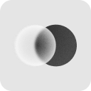
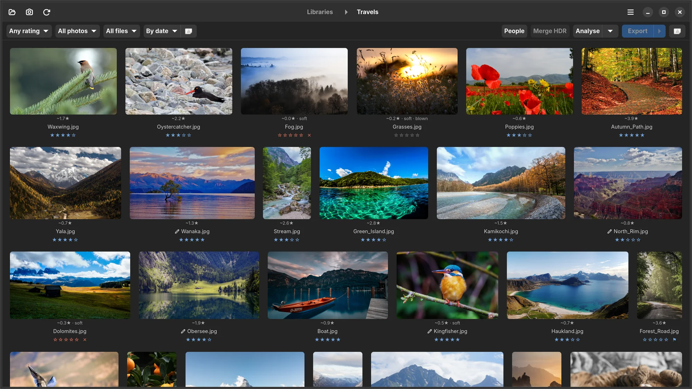
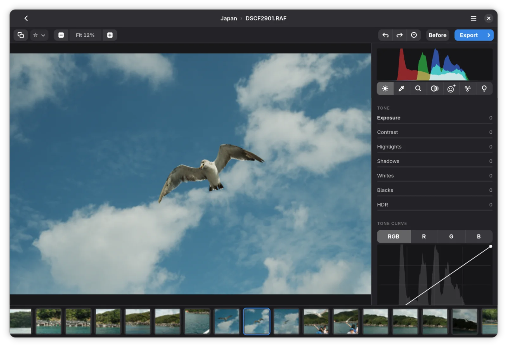
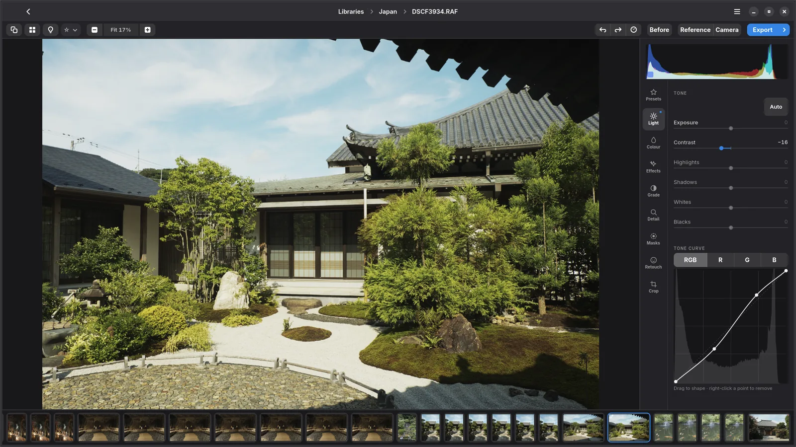
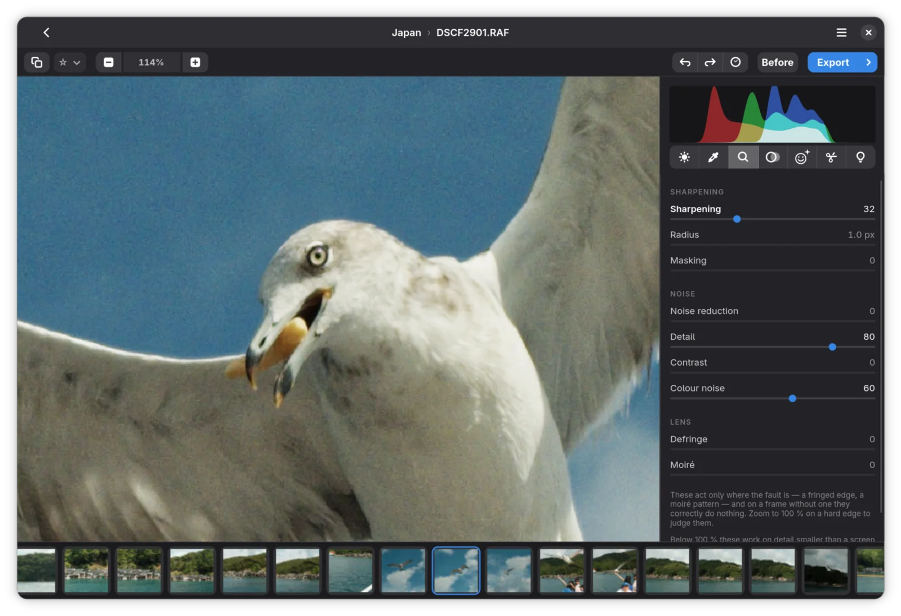
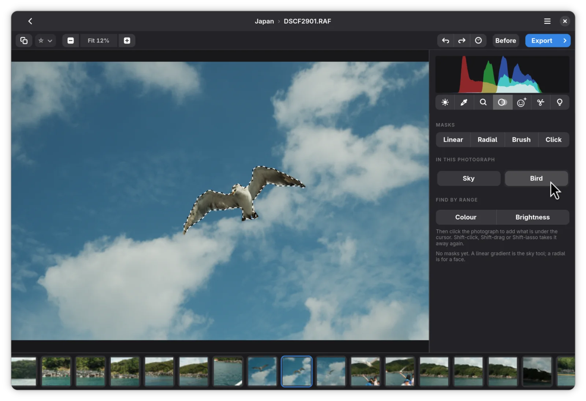
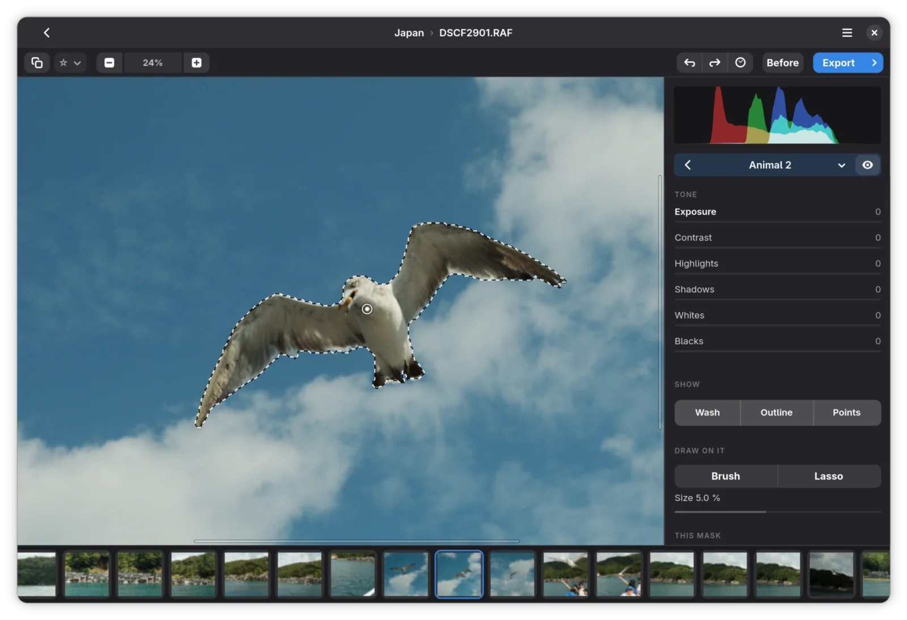

<picture>
  <source media="(prefers-color-scheme: dark)" srcset="data/branding/icon-dark.png">
  
</picture>
<br>
<br>
<br>
<br>
<br>

# Numa

Numa is a RAW photo editor and library for Linux. You add a folder, cull the
shoot, develop the frames you keep and export them. Your originals are never
moved, copied or written to.

It is a native GTK4 and libadwaita application written in Rust. It was built
around a Fujifilm workflow, but it opens and develops every RAW format its
decoder reads.

The code was written with Claude (Anthropic); see [How it was made](#how-it-was-made).



---

## Contents

- [Library](#library)
- [Culling](#culling)
- [People](#people)
- [Developing](#developing)
- [Detail](#detail)
- [Lens and geometry](#lens-and-geometry)
- [Masks](#masks)
- [Retouching](#retouching)
- [Export](#export)
- [Working in the editor](#working-in-the-editor)
- [Cameras](#cameras)
- [Installing](#installing)
- [Building from source](#building-from-source)
- [How it renders](#how-it-renders)
- [Built on](#built-on)
- [Roadmap](#roadmap)
- [How it was made](#how-it-was-made)
- [Licence](#licence)

---

## Library

**Folders, not imports.** A library is a folder on disk. Numa scans it and
leaves the files where they are. Each library keeps its catalog in a hidden
`.numa` folder inside it: ratings, flags, edits, analysis and the names on
faces. Move the folder to another drive or computer, add it there, and
everything comes with it. A weekly backup of that catalog is kept in the same
place. A library on a drive that is not connected shows as offline rather than
empty.

**Rows at each photograph's own shape.** Thumbnails are laid out in justified
rows that fill the width, so portrait and landscape frames sit side by side
without cropping. The order is the filter's order, read left to right. A
popover sets the row size and the spacing between photographs. Thumbnails are
generated at a resolution that stays sharp at that size on HiDPI screens, and
only what is near the screen is decoded, so a library of thousands scrolls
without holding all of them in memory.

**Rate, flag and filter from the keyboard.** `0`–`5` rate, `P` picks, `X`
rejects and `U` clears, in the library and in the editor alike. Filter by
rating, flag and the culling measures, and sort by date, name, rating,
sharpness or suggested rating. The filter is remembered between sessions.

**See what you have worked on.** Photographs with adjustments carry a small
mark in the library and in the filmstrip. Opening a photograph does not count
as editing it.

**Manage several libraries.** Add, rename and remove libraries, see how many
photographs each holds, and switch between them from the header bar. Numa
reopens the last library you had open.

Deleting a photograph moves the file to the desktop's trash, and the dialog
says first that its rating and edits go with it.

## Culling

**Analyse** runs over a whole library in the background, with a progress
count and a Stop button, and measures each frame:

- **Sharpness**, as Laplacian energy on a standardised version of the frame,
  so a contrasty photograph does not score as sharper than a soft one.
- **Blown highlights**, as the share of clipped pixels.
- **Faces**, found with YuNet, and how sharp each face is. A crisp background
  behind a soft face is a reject even when the frame as a whole measures sharp.
- **Bursts**, grouped by a perceptual hash, with the sharpest frame of each
  burst marked as the best of it.

From these Numa suggests a rating from 0 to 5, shown beside each photograph
with a short note (such as *best of burst*, *soft* or *soft face*) and
available as a sort. The suggestion comes from explicit rules rather than a
trained aesthetic model, and it never overwrites a rating you gave.

## People

Numa recognises faces across all of your libraries with SFace, aligned on
YuNet's landmarks.

- **Name a face once.** Every other photograph with a similar face offers that
  name as a guess. Enter confirms it, typing corrects it. Only the names you
  confirm are stored; the likeness does the rest, so a name given today also
  finds last year's photographs.
- **Name faces in bulk.** The People dialog groups faces that are probably the
  same person ("In 38 photographs — who is this?") so a whole group gets a name
  at once. Strangers who keep turning up can be set aside, renaming a person
  renames them everywhere, and giving two people the same name merges them.
- **Browse by person.** Everyone with a name is listed in the library picker
  under the libraries. Picking a person shows every photograph they appear in,
  across all libraries, and the rating, flag and sort filters still apply.

## Developing



Everything below is non-destructive. Edits are stored as a list of operations
and parameters, and the original file is only ever read.

**Light.** Exposure, contrast, highlights, shadows, whites and blacks. **Auto**
sets exposure and the black and white points and leaves the matters of taste
alone. It is a button, never a default.

**Tone curve.** A point curve over the photograph's own histogram, on the
composite channel and on red, green and blue separately. The curve is a
monotonic cubic, so a steep section never folds back on itself, and it is
applied with interpolation so it does not introduce banding in skies and
shadows.



**White balance.** Temperature in Kelvin and tint, applied in the camera's own
colour space before the colour matrix, which is where it is physically correct.

**Colour.** Vibrance and saturation. An eight-colour HSL mixer with a pipette:
click the sky in the photograph and the mixer selects whichever colour the sky
actually is. **Colour grading** with separate tints for shadows, midtones,
highlights and the whole frame, plus blending and balance.

**Camera profiles.** Numa reads DNG camera profiles (`.dcp`): forward
matrices, hue/saturation maps and look tables. The Colour tab lists every
profile installed for your camera, including Adobe's *Camera Matching* profiles
that reproduce a camera's own modes, or none at all. Profiles are matched on
the camera model written inside the profile rather than on its filename.

**Colour spaces.** Edit in sRGB, Display P3, Adobe RGB or ProPhoto RGB, and
export in any of them.

**Local tone mapping.** HDR compression, clarity and texture use the same
edge-aware guided filter at different scales: clarity works at the size of a
cheek or a cloud, texture at the weave of a fabric or the bark of a tree.
Negative texture softens skin without softening eyes. Negative clarity spreads
light like a diffusion filter rather than blurring.

**Clipped highlights stay neutral.** Where all three channels hit the sensor's
ceiling, white balance leaves them white instead of tinting them magenta.

**The base render.** A RAW is developed with a tone curve fitted against the
camera's own JPEGs, and exposure is matched per image to the camera's
rendering, so the untouched starting point already looks like a finished
photograph rather than a flat scan.

## Detail



**Sharpening** is an unsharp mask on log luminance, applied as a gain so edges
do not grow colour fringes. It has amount, radius and masking, where masking
keeps sharpening off flat areas and noise. It is on by default at a moderate
25, because every demosaic softens a little.

**Noise reduction** has separate luminance and colour controls. Luminance noise
is smoothed with an edge-preserving guided filter; **Detail** decides where
grain ends and structure begins, and **Contrast** returns the coarse texture
the smoothing removes, so skin and foliage do not turn to plastic. Colour noise
reduction takes hue from a heavily smoothed copy and brightness from the
original. It is on by default, because colour speckle is never wanted.

**Moiré** removes false colour from fine repeating patterns such as fabric and
roof tiles. **Defringe** removes the purple and green rims that fast lenses
leave on high-contrast edges.

## Lens and geometry

**Lens corrections.** Vignetting, distortion and lateral chromatic aberration
are corrected in a single resampling pass. Fujifilm cameras write their lens
corrections into each RAF, and Numa uses those first. Everything else is
corrected from the lensfun database.

**Crop and straighten** with handles, aspect ratio presets and a rule-of-thirds
overlay. Quarter turns and EXIF orientation are handled.

**Perspective.** Vertical, horizontal and aspect corrections, or **Auto**,
which finds the photograph's own lines and puts converging verticals back
upright.

## Masks

Every mask carries the full set of Light and Colour adjustments, so a local
edit is the same edit as a global one, applied through a shape. Masks are kept
in a list that can be reordered by dragging, and each can be inverted,
feathered, and have its edge moved in or out.

**Draw them:** linear and radial gradients, a brush and a lasso. The brush and
lasso add to or subtract from any mask, so a sky mask that caught the roofline
can be cleaned up by painting it out.

**Let the photograph find them:**

- **Semantic presets.** Sky, buildings, people, animals, greenery, ground,
  water and more, from EfficientViT-Seg trained on ADE20K. Only the presets
  for things actually found in the frame are offered.
- **Click to select.** Click any object and SlimSAM cuts it out, including
  things no segmentation model has a word for, such as a kite.
- **Subject.** Person and Animal fall back to a matting model when the
  semantic model finds nothing, and the chip names the animal ("Bird", "Dog")
  when an image classifier is confident.
- **Refine edge.** IS-Net matting traces a real edge through hair and fur.
- **By colour or brightness.** Colour range and luminance range masks select
  every pixel of a colour or between two brightnesses, anywhere in the frame.

A mask can be shown as a coloured wash, an outline, or both, each with its own
switch.

| | |
|---|---|
|  |  |

## Retouching

**Heal** replaces a spot with texture from elsewhere while keeping the
surrounding tone, solved as a Poisson blend. **Clone** copies it as is. The
source and destination are both drawn on the photograph, so it is always clear
which is which.

**Face retouching** appears only when a face has been found: automatic spot
removal, skin smoothing, evenness, red-eye and teeth whitening.

## Export

- **JPEG or PNG**, with the JPEG quality you choose.
- **Full size, or a long edge from 4096 down to 1080 pixels**, resized with
  Lanczos and never enlarged. Output sharpening restores the edge that
  downscaling takes off.
- **The camera's own EXIF**, carried over into the exported JPEG.
- **Batch export** of a selection from the library, with the same settings as
  the editor. Masks are recomputed before export, so they apply the same way
  they did on screen.
- **Never overwriting.** Files go to an `edited` folder inside the library, or
  to a folder you choose.

Preview and export run the same code on the same edit stack. The preview just
uses fewer pixels.

## Working in the editor

- **Saving is automatic**, two seconds after the last change, and when you
  step to another photograph, leave the editor or quit.
- **Undo and redo** cover every adjustment, geometry and mask, with a
  history list that names each step.
- **Before and after**, compared against the as-shot rendering.
- **A live RGB histogram**, with clipped shadows and highlights shown on the
  photograph.
- **Copy and paste settings** between photographs, with a checklist of what to
  paste: white balance, tone, colour, tone curve, detail and crop. Paste onto a
  single photograph or a whole selection.
- **A filmstrip** to move between frames without returning to the library.
- **Zoom** from fit to 1:1 and beyond. Above 1:1 pixels are drawn as pixels.
  When you zoom past what the preview resolution can show, the visible region
  is rendered from the full-resolution file.
- **Adjusted sliders are highlighted**, so you can see at a glance what was
  changed on a photograph. Double-click or right-click a slider to reset it,
  and hold Shift with the arrow keys to move it ten steps at a time.
- **Info** shows camera, lens, exposure, Fujifilm film mode and dimensions.
- **HDR merge** combines a bracket into one high-dynamic-range image. There is
  no alignment yet, so shoot brackets on a tripod.
- **Keyboard shortcuts** are listed under `Ctrl+/`.

---

## Cameras

Numa reads anything [`rawler`](https://github.com/dnglab/dnglab) reads:
twenty-nine RAW formats across 811 camera and mode combinations, plus JPEG,
PNG and HEIF (`.heic`, `.heif`, `.hif`). The list of supported formats is taken from the decoder, so it grows when
the decoder does.

Fujifilm files get extra support: the Markesteijn X-Trans demosaic at full
resolution, the film simulation the camera was set to, and the lens
corrections stored in the RAF. Everything else goes through the same pipeline
without them.

Tested end to end on Fujifilm RAF and Sony ARW files.

---

## Installing

Numa is distributed as a single file, `Numa-<version>-x86_64.AppImage`.
It runs on 64-bit Intel and AMD machines with glibc 2.39 or newer: Ubuntu 24.04
and later, Debian 13 and later, Fedora 40 and later, and current rolling
releases such as Arch.

A downloaded file is not executable, and until it is, double-clicking it does
nothing. In GNOME Files, open **Properties** on the file and turn on
**Executable as Program**; or in a terminal:

```sh
chmod +x Numa-*-x86_64.AppImage
./Numa-*-x86_64.AppImage
```

After that it starts with a double-click. Keep the file where it is, for
example in `~/Applications`; nothing is installed elsewhere.

The AppImage mounts itself with FUSE and needs the `fusermount3` (or
`fusermount`) program, which most desktop installations already have. It does
not need `libfuse2`. If it does not start and running it from a terminal
mentions fusermount or FUSE, install:

| Distribution | Package |
|---|---|
| Debian, Ubuntu | `sudo apt install fuse3` |
| Fedora | `sudo dnf install fuse3` |
| Arch | `sudo pacman -S fuse3` |

Where FUSE is not available at all, for example in a container, it can run
without it; it then unpacks itself to a temporary folder on every start, which
takes a few seconds longer:

```sh
./Numa-*-x86_64.AppImage --appimage-extract-and-run
```

On first start Numa offers to add itself to the applications menu, and to
download the additional files described below: the machine-learning models and
RawTherapee's camera profiles. If the AppImage is moved or replaced by a newer
one, the menu entry follows it the next time Numa starts from the new place.
Preferences has a switch to remove the entry again.

## Building from source

You need a Rust toolchain, GTK 4.12 or newer, libadwaita 1.5 or newer, and
`pkg-config`.

```sh
git clone git@github.com:simmmmm/Numa.git
cd Numa
./dev/run.sh
```

Some features use additional files that are downloaded separately: the
machine-learning models for masks, click to select, subject edges, faces and
animal names, and RawTherapee's camera profiles. Numa offers them on first
start, and **Preferences** (`Ctrl+,`) downloads them, shows what is installed
and opens the folders they live in. Without them everything else works. From a
source checkout, `./dev/fetch-models.sh` fetches the models as well.

### Where things live

| | |
|---|---|
| Library catalog, history, snapshots, backups | `<your library>/.numa/` |
| Grid thumbnails | `<your library>/.numa/thumbs/` |
| Application settings, list of libraries, albums | `~/.local/share/numa/catalog.db` |
| Models | `~/.local/share/numa/models/` |
| Presets | `~/.local/share/numa/presets/` |
| Camera profiles you add | `~/.local/share/numa/profiles/` |
| Downloaded RawTherapee profiles | `~/.local/share/numa/rawtherapee-dcpprofiles/` |
| Larger thumbnails, AI denoise results | `~/.cache/numa/` |
| Exports | `<your library>/edited/` unless another folder is chosen |

These are the usual locations; inside a Flatpak they are under `~/.var/app`.
Preferences shows the actual folders. Deleting a thumbnail folder or the
cache only means those files are made again.

### Packages

There is a Flatpak manifest in `packaging/flatpak/` and an AppImage build in
`packaging/appimage/`, which builds inside a container so the result runs on
older distributions:

```sh
./packaging/appimage/build.sh
```

---

## How it renders

```
RAW file
  └─ decode + demosaic ──────────> linear RGB, f32, scene-referred
       │
       ├─ colour stage      white balance in camera space, then the camera
       │                    matrix and its profile's tables   (cached)
       │
       ├─ geometry          lens corrections, quarter turns, crop,
       │                    straighten, perspective
       │
       └─ pixel stack
            heal and clone ──> face retouching
            noise reduction ──> sharpening
            exposure, contrast, the four tone regions, vibrance, saturation
            the colour mixer
            local tone mapping (HDR, clarity, texture)
            masks, each the same stack again, faded in
            colour grading
            the base tone curve ──> your tone curves ──> output space ──> 8-bit
```

Values stay scene-linear until the last step. In linear light exposure is a
multiplication, downscaling averages correctly, and highlights above 1.0 are
still there for highlight recovery to work with.

While you edit, Numa renders only the region on screen, at the resolution the
screen can show. During a slider drag it draws a fast draft and sharpens the
picture as soon as you let go.

[`docs/ENGINEERING.md`](docs/ENGINEERING.md) explains the decisions and the
measurements behind them: white balance in camera space, the tone curve fitted
against camera JPEGs, DNG profiles, the demosaic, lens corrections, face
recognition thresholds, and the bugs that were hardest to find.

---

## Built on

| Crate | Used for |
|---|---|
| [`gtk4`](https://crates.io/crates/gtk4) + [`libadwaita`](https://crates.io/crates/libadwaita) | The interface. |
| [`rawler`](https://crates.io/crates/rawler) | RAW decoding, demosaic and colour matrices, in pure Rust with X-Trans support. |
| [`heic-rs`](https://crates.io/crates/heic-rs) | HEIF and HEIC, in pure Rust. |
| [`zip`](https://crates.io/crates/zip) | Opening Capture One style packs. |
| [`rusqlite`](https://crates.io/crates/rusqlite) | The catalogs. A rating writes one row, and a filter is a `WHERE` clause. |
| [`ort`](https://crates.io/crates/ort) + [`ndarray`](https://crates.io/crates/ndarray) | ONNX Runtime for every model. |
| [`image`](https://crates.io/crates/image) + [`rayon`](https://crates.io/crates/rayon) | Pixel work across all cores. |
| [`lensfun`](https://crates.io/crates/lensfun) | Lens corrections for lenses that do not describe themselves in the file. |
| [`serde`](https://crates.io/crates/serde) · [`serde_json`](https://crates.io/crates/serde_json) · [`dirs`](https://crates.io/crates/dirs) · [`log`](https://crates.io/crates/log) · [`env_logger`](https://crates.io/crates/env_logger) · [`byteorder`](https://crates.io/crates/byteorder) · [`libc`](https://crates.io/crates/libc) | Supporting work. |

| Model | Used for |
|---|---|
| EfficientViT-Seg-B2 (ADE20K) | Semantic mask presets |
| SlimSAM-77 | Click to select |
| IS-Net | Matting and refined edges |
| YuNet | Face detection |
| SFace | Face recognition |
| PP-ResNet50 (ImageNet) | Naming the animal in a subject mask |

---

## Roadmap

[`docs/FEATURES.md`](docs/FEATURES.md) tracks every feature by ID and is the
only place status is kept: currently **153 built**, 6 partly built, 4 planned
and 11 withdrawn, each withdrawal with its reason.

**Still open.** GPU inference · eyes-closed detection for culling · a neutral
Fujifilm X-T5 camera profile, which needs Provia reference frames.

The full list, generated from the status markers, is at the end of
[`docs/FEATURES.md`](docs/FEATURES.md). How each number in it was reached is in
[`docs/ENGINEERING.md`](docs/ENGINEERING.md) — corrections welcome.

---

## How it was made

Numa is written by Claude, an AI model by Anthropic, working from the
photographer's feedback: comparisons with other raw developers and the
camera's own JPEGs, and reports of what looked wrong. Decisions and
measurements are recorded in [`docs/ENGINEERING.md`](docs/ENGINEERING.md), and
there are 287 automated tests.

---

## Licence

[PolyForm Noncommercial 1.0.0](LICENSE). You may read, run, modify and share
Numa for any non-commercial purpose. Commercial use requires a separate
licence from the author.

The additional files each keep their own licence: the models are Apache-2.0 or
MIT, and RawTherapee's camera profiles are GPL-3.0. The licence texts are
published with the downloads.

## Acknowledgements

- **[RawTherapee](https://rawtherapee.com)** for the DNG camera profiles, most
  of them made by Maciej Dworak. Each names its author in its
  `ProfileCopyright` tag. They are redistributed unmodified under GPL-3.0.
- **[rawler](https://github.com/dnglab/dnglab)** for RAW decoding in Rust.
- **[MIT Han Lab](https://github.com/mit-han-lab/efficientvit)** for
  EfficientViT, **[Xenova](https://huggingface.co/Xenova)** for the ONNX
  conversion of SlimSAM, **[rembg](https://github.com/danielgatis/rembg)** for
  the IS-Net export, and **[OpenCV Zoo](https://github.com/opencv/opencv_zoo)**
  for YuNet, SFace and PP-ResNet.

Not affiliated with or endorsed by Fujifilm.
